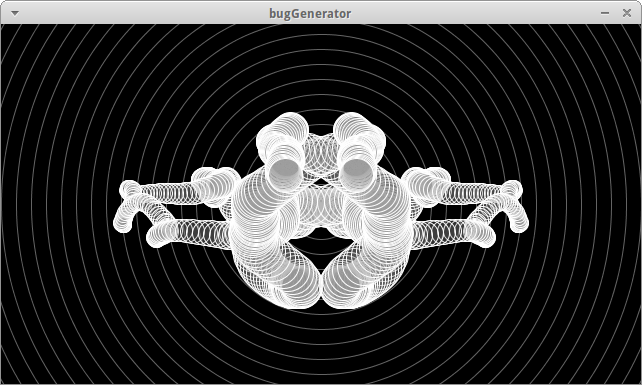
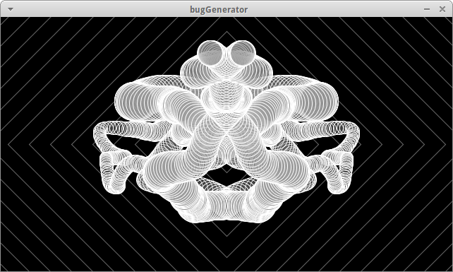
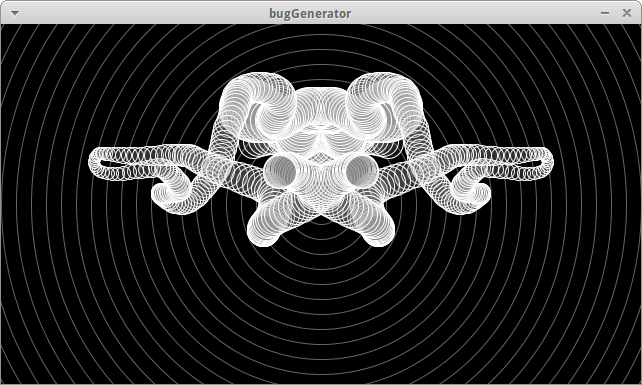
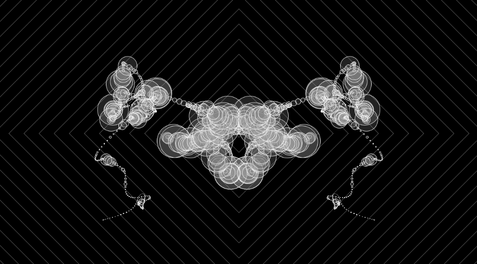

# bug-generator
Small Processing project to create the bug of your dreams. Play with it [here](http://www.deadcells.org/bug-generator/).

Press space to start/stop, press R to reset the canvas. 1 and 2 toggle the background modes. + and - keys speed up or slow down the generation.

Produces things like:

## Bug Visualiser

Modification of the above project use Minim beat detection to turn bug-generation into a mid-2000s WMP visualiser!

Here is an [example](https://vimeo.com/134623868) of it working.
